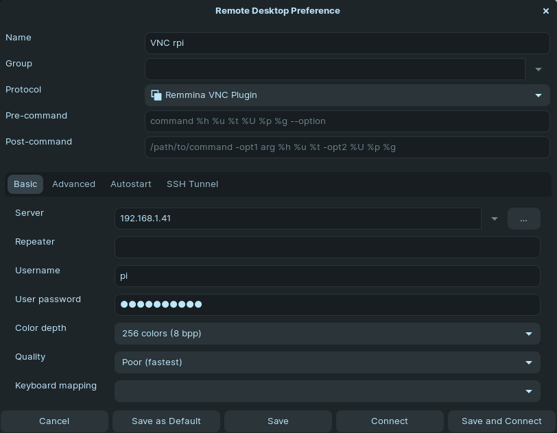

# Connect to Raspberry Pi OS via VNC using Remmina

RealVNC only supports a few security schemes. Authentication=VncAuth seems to be the only scheme that allows direct connections from VNC-compatible Viewer projects from third parties. In order to change to VncAuth scheme in your Raspbian and set a password to accept connections from Remmina VNC plugin, open a SSH session (or a terminal window) on the Raspberry and generate your VNC password with:

```
sudo vncpasswd -service
```

Now, edit the file /root/.vnc/config.d/vncserver-x11:

```
sudo nano /root/.vnc/config.d/vncserver-x11
```

and add the following line at the end of the file:

```
Authentication=VncAuth
```

Now your config file should look more or less like mine:

```
_AnlLastConnTime=int64:0000000000000000
_LastUpdateCheckSuccessTime=int64:01d8eef139625568
_LastUpdateCheckTime=int64:01d8eef139625568
Authentication=VncAuth
Password=caef920b788e4020b93be0a01278bcb3
```

`caef920b788e4020b93be0a01278bcb3` is the encrypted version of `Testing321`; your line will be different.

Eventually, restart the VNC server service with

```
sudo systemctl restart vncserver-x11-serviced
```

and you are ready to connect to you Raspberry Pi using Remmina.


